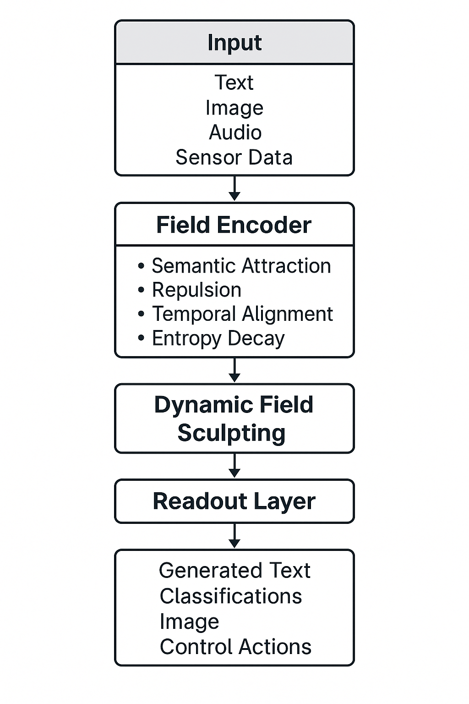

# 🛠️ Laminets (Lamina Networks)
> _Field Evolution Models for Emergent Reasoning and Unified Multi-Modal AI_

## Overview

**Laminets** are an experimental AI architecture exploring **continuous semantic field evolution**, as an alternative to discrete token-token attention.

Traditional transformer-based models (e.g., BERT, GPT) rely on pairwise attention operations between tokens, accumulating meaning by stacking many layers.  
While highly effective, this approach has several characteristics worth investigating alternatives for:

- **Quadratic scaling** in input size (`O(n²)`)
- **Artificial memory** structures (positional encodings, caches)
- **Multi-modal integration challenges** (separate pipelines for text, images, etc.)
- **Interpretability limitations** (attention maps can be difficult to correlate to reasoning structures)

**Laminets** propose a different approach to explore:  
Instead of discrete attention, **inputs are embedded into a latent field of points** that **evolve dynamically** under **semantic forces** over continuous simulated time.

This evolution might produce emergent semantic structures — clusters, chains, spirals — potentially representing reasoning, memory, and abstraction in a more continuous fashion.

## Core Concepts

| Component | Description |
|:---|:---|
| **Field Points** | Each input (text token, image patch, audio slice) becomes a latent particle defined by `position`, `velocity`, `mass`, and `semantic charge`. |
| **Evolution Engine** | Points evolve continuously under forces like semantic attraction, repulsion, temporal alignment, and entropy decay. |
| **Memory** | Stable topological features in the field (e.g., attractors, spirals) naturally encode persistent information. |
| **Reasoning** | Global semantic structures form from local interactions — reasoning emerges without discrete attention heads. |
| **Multi-Modal Fusion** | All modalities embed into the same field; no cross-attention or late fusion required. |

## Architecture Diagram



## Comparison to Transformers

| Aspect | Transformers | Laminets (Hypothesized) |
|:---|:---|:---|
| Core mechanism | Token-token attention | Field evolution by semantic forces |
| Scaling | `O(n²)` (quadratic) | Potentially `O(n)` (depends on implementation) |
| Reasoning | Emergent via deep stacking | Might emerge via field resonance |
| Memory | Positional encodings, caches | Field attractors as potential memory structures |
| Multi-modal handling | Separate encoder/decoder paths | Potential native fusion into common field |
| Interpretability | Attention maps | Field topology visualization |

## Why Explore Field Evolution?

- **Continuous-Time Representation:**  
  Meaning structures could flow over continuous simulated time rather than discrete steps.

- **Alternative to Explicit Layers:**  
  Reasoning might arise from the dynamics of interacting forces, potentially reducing the need for hundreds of stacked transformer layers.

- **Different Approach to Memory:**  
  Field configurations might act as alternative memory structures.

- **Potential for Multi-Modal Embedding:**  
  Field points could originate from any modality, with interaction based on meaning proximity.

## Research Direction

We hypothesize that **field evolution models** (FEMs) might offer advantages in certain applications:

- Novel approaches to reasoning
- Alternative memory structures
- Unified multi-modal understanding
- New interpretability methods

Laminets represent an early exploration of this hypothesis.

We invite experimentation, critique, and extension of this research from the broader AI community.

## Repository Contents

This repository provides:

- **Notebooks**: Jupyter notebooks for training and evaluating Laminet models
  - `notebooks/laminet_training.ipynb`: Standard training implementation
  - `notebooks/laminet_training_optimized.ipynb`: Optimized training for faster results
  - `notebooks/laminet_training_generative.ipynb`: Field-based text generation
  
- **Datasets**: Tools and data for training Laminet models
  - Dataset generation scripts
  - 1K and 10K sample datasets for training
  - Custom vocabulary files

- **Documentation**:
  - Technical whitepaper
  - Implementation guides

## Installation

```bash
pip install torch matplotlib numpy tqdm scikit-learn ipywidgets transformers
```

## Hypothetical Capabilities

This section outlines what different training scales might achieve. These are research hypotheses based on theoretical understanding, not guarantees:

### 1K Dataset (Current Prototype Implementation)
```
User: How does the weather feel today?
Laminet: The cool breeze rustled the leaves as they sat on the porch.

User: I'm feeling a bit sad today.
Laminet: The melancholy music of the violin solo brought tears to several audience members.

User: Can you explain a complex concept?
Laminet: The software had a complex architecture that made modifications risky.
```
**Characteristics**: Limited vocabulary (~500 words), retrieval-based responses that echo training phrases, limited concept transitions, no dialogue flow, predictable patterns

### 10K Dataset (Research Target)
```
User: How does the weather feel today?
Laminet: The temperature feels mild with a gentle breeze. It's comfortable enough to be outside without needing heavy clothing.

User: I'm feeling a bit sad today.
Laminet: That melancholy feeling can be difficult. Sometimes it helps to acknowledge the emotion rather than trying to escape it.

User: Can you explain a complex concept?
Laminet: Complex systems often involve many interconnected parts that work together in ways that create unexpected behaviors. Think of how weather patterns emerge from countless atmospheric interactions.
```
**Characteristics**: Larger vocabulary (~3,000 words), more varied responses, better semantic connections, potentially some original combinations, basic dialogue elements

### Future Research Directions

Beyond the current implementations, we're interested in exploring whether substantially larger datasets could lead to:

- More sophisticated concept mapping
- Improved dialogue coherence
- Better handling of abstract concepts
- More nuanced emotional understanding
- Emergent properties not present in smaller models

This is an open research question requiring extensive empirical validation.

## License

This project is licensed under the MIT License.